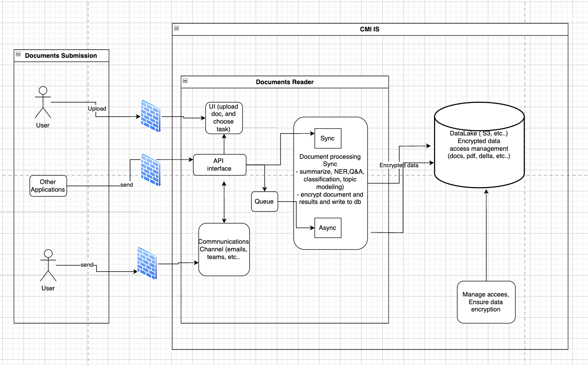

# Global Architecture Document for Document Reader Tool (GAD)

The Document Reader Tool is designed to efficiently manage and process documents from various sources, ensuring secure storage, processing, and retrieval. The architecture comprises several key components:

## Document Sources:
- Applications: External applications can send documents directly to the system via the Application Programming Interface (API).
- Users: End users can upload documents through the User Interface (UI), facilitating manual submissions.
- Emails: Documents received via email are extracted and forwarded to the system through the API interface.

## Document Processing:
- API Interface: Acts as the central communication hub, receiving documents from various sources and forwarding them to processing modules.
Processing Modules: Handle tasks such as Named Entity Recognition (NER), summarization, and other analyses.
- Processing can be:
    - Synchronous: For real-time processing, providing immediate feedback to users or applications.
    - Asynchronous: For batch processing, suitable for handling large volumes of documents without immediate response requirements.

## Storage and Security:
- Database (DB): Processed documents and their metadata are stored in a secure database for future retrieval.
- Encryption: Ensures that sensitive documents are encrypted, maintaining confidentiality and compliance with data protection regulations.
- Access Control: Manages user permissions to control who can access, modify, or delete documents, ensuring data integrity and security.

    

