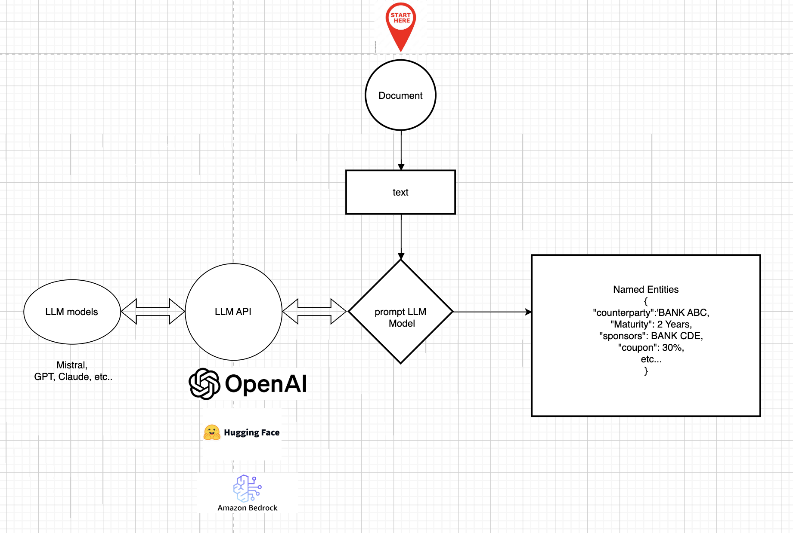
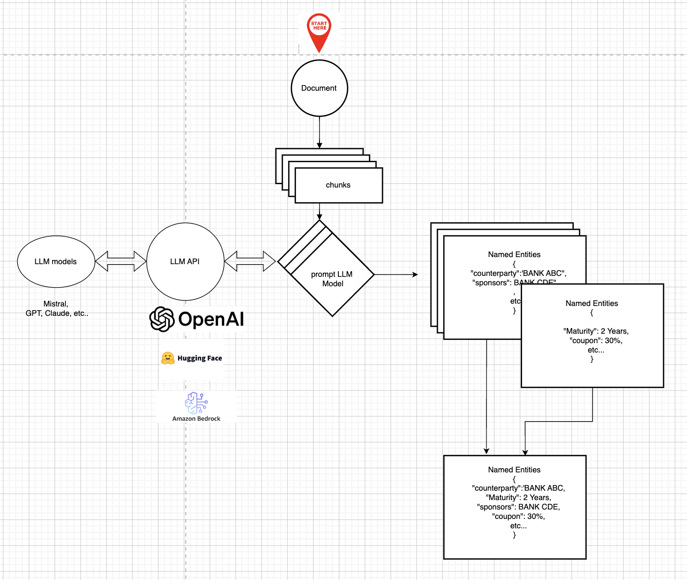

# Global Methodology Document (GMD)

## Introduction
The document presents a methodology to build an entity extraction pipeline that relies on Large Language Models (LLMs).
Given for example a pdf file, with unstuctured text, we will use a LLM to extract named entities.
The document will also include a description of the prompting to be used.


## Step 1: extract text from documents and clean it
The initial step involves extracting text from documents, which may exist in various formats such as PDF, DOCX, and TXT.
- for pdf files, the PyMuPDF library can be used
- for docx files, the python-docx library can be used
- for txt files, the built-in open function can be used

example of code:
```python
import fitz  # PyMuPDF
def extract_text_from_pdf(pdf_path):
    # Open the PDF file
    document = fitz.open(pdf_path)
    text = ""
    # Iterate through each page
    for page_num in range(len(document)):
        page = document.load_page(page_num)
        text += page.get_text()
    return text
```


We can then clean the extracted text by removing any unnecessary characters, symbols, extra spaces, etc. This can be done using regular expressions or string manipulation functions in Python.

## Step 2: extract named entities
Once the text is extracted from the document, we can use a LLM to extract named entities. This can be done using HuggingFace Transformers library, which provides a wide range of pre-trained models for natural language processing tasks or closed source libraries like OpenAI or AWS Bedrock.
### Closed-Sourced API services
1. OpenAI :
- GPT 3.5, GPT 4, etc.

2. AWS Bedrock
- Claude (Anthropic), Titan (AWS), etc.

### Open-Source Libraries
1. Hugging Face Transformers
- mistral, qwen, flan (google), etc..

The choice of the API or library will depend on the specific requirements of the project, such as the desired level of accuracy, speed, and cost.
If we need to implement a quick POC, we can use commercial api services where we dont have to worry about the model architecture, training, etc. Once the PoC is successful, and for data privacy and security reasons, we might switch to use open-source models that can be hosted on-premises or in a private cloud.

### Method 1: NER with Full-Context Prompting

This method involves providing the entire document text as context within a single prompt and asking the LLM to extract entities. It works best for short sized documents where token limits allow full-context processing.



In the prompting, a fixed output format must be chosen to ensure reproducibility and allow evaluation with a consistent reference. It also facilitates integration into automated processes, as JSON is machine-readable and easily usable in subsequent steps.
Note that

Prompt example:

```
Extract named entities from the following text. Identify the financial entities from the text:
- Counterparty
- Initial_Valuation_Date
- Sponsors
- Maturity (Termination Date)
- Underlying
- Coupon
Text:
{text}

Provide the output in JSON format like this:
{
    "Counterparty": "Bank XYZ Corp",
    "Initial_Valuation_Date": "2022-01-01",
    "Sponsors": "Company ABC",
    "Maturity (Termination Date)": "2023-01-01",
    "Underlying": "Stock XYZ",
    "Coupon": "5%"
}
if there is an entity that you dont find in the text, please provide a value of "Not Found" like this:
{
    "Counterparty": "Bank XYZ Corp",
    "Initial_Valuation_Date": "2022-01-01",
    "Sponsors": "Not Found",
    "Maturity (Termination Date)": "2023-01-01",
    "Underlying": "Stock XYZ",
    "Coupon": "5%"
}
```

Note that this method is limited by the token limit of the model, which can be around 4096 tokens for models like GPT-3.5 and GPT-4. If the document exceeds this limit, we need to use chunk-based processing.

### Method 2: NER with Chunk-Based Processing

If the text exceeds the token limit, this method divides the text into smaller chunks, extracts entities from each using the same prompt as method 1, and then merges results.



## Evaluation
The evaluation of the entity extraction pipeline can be done by comparing the extracted entities with a manually annotated dataset. The evaluation metrics can include precision, recall, and F1 score.

$Precision = \frac{TP}{TP + FP}$, is the ratio of correctly predicted positive observations to the total predicted positives.

Recall = $\frac{TP}{(TP + FN) }$, is the ratio of correctly predicted positive observations to the all observations in actual class.

F1 Score = 2 \cdot \frac{Precision \cdot Recall}{Precision + Recall}$

Where TP = True Positives, FP = False Positives, FN = False Negatives.

## Conclusion
This document provides a methodology to build an entity extraction pipeline using Large Language Models. The choice of the LLM, the prompting technique, will depend on the size and complexity of the documents to be processed.
