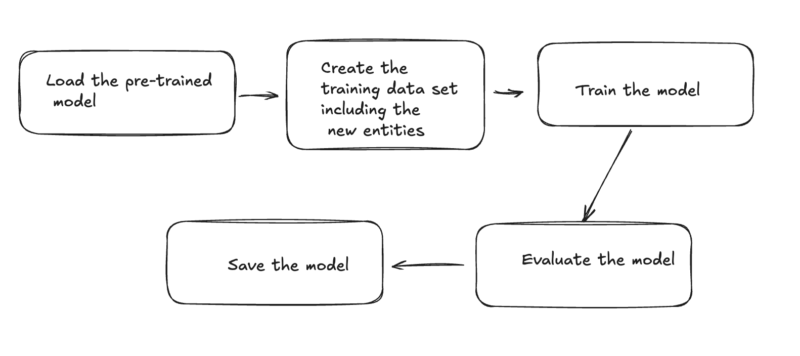

# Financial entity recognition fine-tuning

## Context
General NER entity can recognize basic entities such as organization, person, location, date, time, etc. However, it is not able to recognize financial entities such as ISIN, Counterparty, Notional, Underlying, Maturity, Bid offer, PaymentFrequency, etc..that are not commonly found in general text. A global model might fail to detect these entities. For example it might classify:

- Bank ABC as a PERSON instead of a COUNTERPARTY
- 7Y as a DATE rather than a MATURITY

To recognize these financial entities, we need to fine-tune a pre-trained NER model. The models learns to recognize the financial entities by training on a dataset that contains examples of these entities.

In general, the fine-tuning process consists of the following steps:




## Spacy Fine tune
### Train data preparation
The first step is to prepare the training data. The training data should be in the form of a list of tuples, where each tuple contains a text and a dictionary of entities. The dictionary of entities should be in the form of a list of tuples, where each tuple contains the start and end index of the entity in the text, and the label of the entity.
```python
# Extended training dataset
DATA = [
    (
        "11:49:05 I'll revert regarding BANK ABC to try to do another 200 mio at 2Y",
        {'entities': [('BANK ABC', 'Counterparty'), ('200 mio', 'Notional'), ('2Y', 'Maturity')]}
    ),
    (
        "Bank XYZ proposes a 150 mio trade on FR0098765432 with a spread of ESTR+50bps",
        {'entities': [('Bank XYZ', 'Counterparty'), ('150 mio', 'Notional'), ('FR0098765432', 'ISIN'), ('ESTR+50bps', 'BidOffer')]}
    ),
]
```
The data annotation should be done manually with the help of business experts. More data will lead to better performance.

### Model training
Frameworks like spaCy or Hugging Face's Transformers make it simple to fine-tune models with minimal coding. Here is how to fine-tune a spaCy model:
```python
def train_model(nlp):
    """Train the NER model using financial data."""
    ner = nlp.get_pipe("ner")
    optimizer = nlp.begin_training()

    print(" Training model...")
    for _ in range(50):  # Run 50 iterations for better accuracy
        random.shuffle(TRAIN_DATA)
        for text, annotations in TRAIN_DATA:
            example = Example.from_dict(nlp.make_doc(text), annotations)
            nlp.update([example], drop=0.2, sgd=optimizer)

    # Save trained model
    nlp.to_disk("financial_ner_model")
    print(" Model training complete and saved.")
```
### Model Evaluation
The model should be evaluated on a separate test dataset to ensure that it is generalizing well. The evaluation metrics can be precision, recall, and F1 score.
